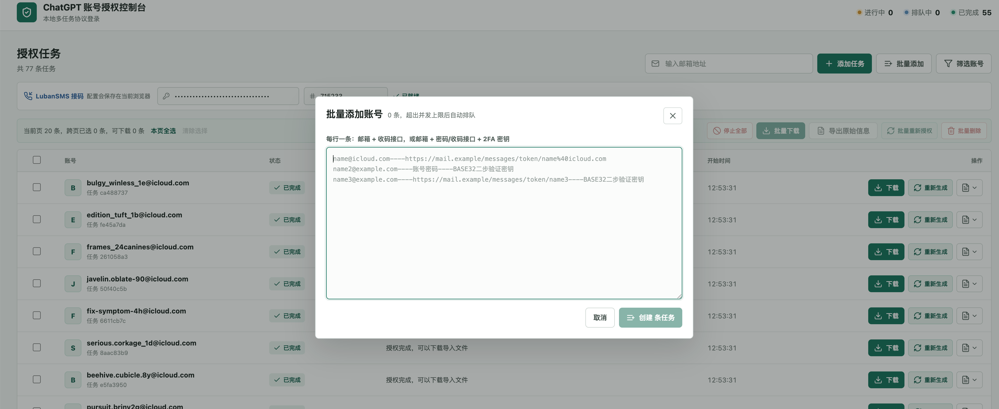

# toSub2

QQ 交流群：`1085165735`

[点击链接加入群聊【toSub2】](https://qm.qq.com/q/n40xuIClm8)

toSub2 是一个本地网页工具，通过协议请求完成 ChatGPT 登录和 Codex OAuth（授权登录），自动判断账号是否需要绑定手机号，并生成可供 sub2api 导入的 JSON（结构化数据）文件。

> 本项目不是 OpenAI 官方项目。上游登录接口随时可能变化。



## 工作流程

1. 通过邮箱验证码或密码登录 ChatGPT。
2. 账号启用 2FA（双重身份验证）时，自动生成并提交 TOTP（基于时间的一次性密码）。
3. 发起 Codex OAuth（授权登录）。
4. 根据服务端响应判断账号是否已经绑定手机号。
5. 未绑定手机号时进入短信验证，支持手动号码或 LubanSMS（鲁班接码）。
6. 选择 workspace（工作区），兑换 OAuth Token（授权令牌）。
7. 生成标准 `sub2api-data` 导入文件。

## 主要功能

- 本地网页控制台，可同时管理多条登录任务。
- 最多同时运行 20 条任务，超出后自动排队。
- 支持手动邮箱验证码、邮箱收码 API（接口）自动取码。
- 支持密码登录，以及密码或邮箱验证码登录后的 2FA（双重身份验证）。
- 自动跳过已经完成手机号绑定的账号。
- 未绑定账号支持手动手机号、手动短信验证码和 LubanSMS（鲁班接码）自动取号收码。
- 邮箱登录成功后立即保存 checkpoint（检查点），中断后可继续手机号流程。
- 支持重新授权；优先使用已有 Refresh Token（刷新令牌），失效后再重新登录。
- 支持分页、精确筛选、跨页多选、批量删除、停止全部、批量重新授权和批量下载。
- 最终输出 sub2api 导入格式，下载文件名自动附带时间戳。

## 环境要求

- Node.js 20 或更高版本，建议使用 Node.js 22。
- macOS 使用 Keychain（钥匙串）持久保存密码和 2FA 密钥。
- Windows 使用当前用户的 DPAPI（数据保护接口）加密保存，密文位于 `%LOCALAPPDATA%\toSub2\credentials`，只能由同一个 Windows 用户解密。
- Linux 仍可使用邮箱验证码流程，但目前不持久保存密码和 2FA 密钥。

## 安装与启动

```bash
git clone https://github.com/poxiao33/toSub2.git
cd toSub2
npm install
npm run dev
```

默认访问地址：

```text
http://127.0.0.1:4399
```

指定其他端口：

```bash
npm run dev -- --port 4400
```

允许局域网设备访问：

```bash
npm run dev -- --host 0.0.0.0
```

局域网模式没有访问认证，只应在可信网络内短时间使用。

## 批量添加格式

每行一个账号，支持以下格式：

```text
邮箱
邮箱----邮箱收码接口
邮箱----密码
邮箱----密码----2FA身份验证密钥
邮箱----邮箱收码接口----2FA身份验证密钥
```

示例：

```text
name@example.com
name2@example.com----https://mail.example/messages/account-token
name3@example.com----账号密码----JBSWY3DPEHPK3PXP
name4@example.com----https://mail.example/messages/account-token----JBSWY3DPEHPK3PXP
```

第二段以 `http://` 或 `https://` 开头时按邮箱收码接口处理，否则按密码处理。邮箱是唯一字段，重复导入会更新原任务资料。

## LubanSMS 配置

API Key（接口密钥）和供应商编号在网页顶部统一填写，修改后立即保存到当前浏览器的 localStorage（本地存储）。点击任务中的“平台取号”时会读取输入框最新值。

API Key 只会随取号请求临时发送给本地服务，不会写入任务元数据、协议日志或导出文件。手动手机号和手动验证码流程始终保留。

## 输出文件

任务运行数据默认保存在：

```text
tmp/chatgpt-onboarding-console/<任务 ID>/
```

每个完成任务会生成 `sub2api-import-oauth.json`。单账号和批量下载均输出标准 `sub2api-data` 格式。

也可以直接使用 CLI（命令行工具）：

```bash
node src/protocol-login.mjs --email you@example.com --verbose
```

查看全部参数：

```bash
node src/protocol-login.mjs --help
```

## 安全说明

- `tmp/` 中包含 Cookie（登录凭证）、OAuth Token（授权令牌）和登录检查点，禁止提交或分享。
- Windows 保存的密码和 2FA 密钥由 DPAPI（数据保护接口）按当前用户加密，不会以明文写入任务目录。
- sub2api 导入文件包含可用的授权令牌，应当按密码文件保护。
- 不要把 API Key、密码、2FA 密钥、验证码、Cookie 或 Token 提交到 Git 仓库。
- 网页控制台用于本机或可信局域网，不提供公网部署所需的身份认证。
- 只处理你本人持有或已获得明确授权的账号。

## 免责声明

本项目仅供学习、研究和管理本人账号使用，不隶属于 OpenAI，也未获得 OpenAI 背书。使用者应自行遵守 OpenAI 服务条款、相关平台规则以及所在地法律法规。因接口变更、账号限制、数据泄露或不当使用造成的后果由使用者自行承担。

## 更新日志

版本变化和升级说明请查看 [CHANGELOG.md](CHANGELOG.md)。

## License（开源许可证）

[MIT](LICENSE)
